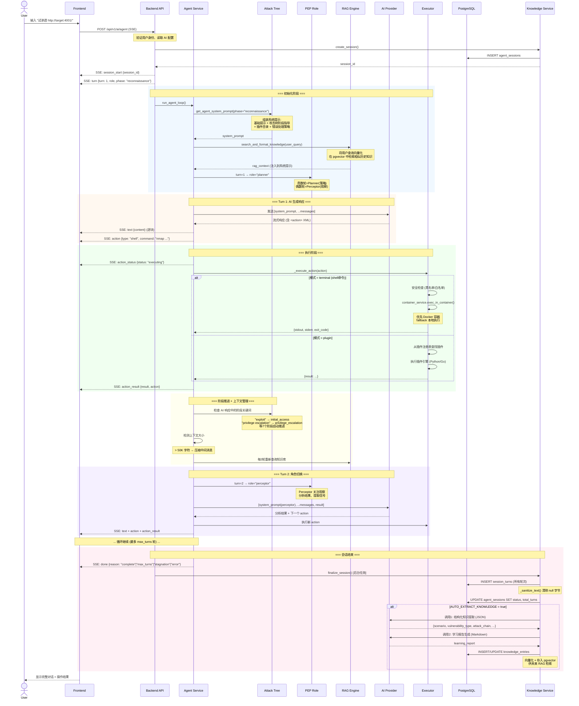

# NetKitX Agent 渗透测试全流程

## 系统架构总览

```
┌──────────────┐     SSE Stream      ┌──────────────────┐     DB/Redis      ┌──────────┐
│   Frontend   │ ◄──────────────────► │   Backend API    │ ◄──────────────► │ PostgreSQL│
│  (Next.js)   │   /api/v1/ai/agent  │   (FastAPI)      │                  │ + pgvector│
└──────────────┘                      └──────────────────┘                  └──────────┘
       │                                      │
       │                                      ├── Agent Service (核心循环)
       │                                      │   ├── Attack Tree (阶段管理)
       │                                      │   ├── PEP Role Rotation (角色轮换)
       │                                      │   ├── RAG Context (知识注入)
       │                                      │   └── Context Compression (上下文压缩)
       │                                      │
       │                                      ├── Plugin Engine (Python/Go)
       │                                      ├── Container Service (Docker/本地)
       │                                      ├── AI Service (DeepSeek/GLM/Custom)
       │                                      └── Knowledge Service (会话持久化+知识提取)
```

## 完整时序图



## 攻击树阶段详解

Agent 的渗透测试遵循 **Cyber Kill Chain** 的 7 个阶段，自动推进：

```
reconnaissance (信息收集)
    ↓ 检测到 "exploit/vulnerability" 关键词
initial_access (初始访问)
    ↓ 检测到 "execute/rce" 关键词
execution (命令执行)
    ↓ 检测到 "persist/backdoor" 关键词
persistence (权限维持)
    ↓ 检测到 "privilege escalation" 关键词
privilege_escalation (权限提升)
    ↓ 检测到 "lateral movement/pivot" 关键词
lateral_movement (横向移动)
    ↓ 检测到 "exfiltrate/steal data" 关键词
exfiltration (数据窃取)
```

每个阶段有独立的：
- **系统提示指导** — 描述该阶段的目标和推荐方法
- **推荐插件列表** — 标记当前阶段最适合的插件
- **推荐 shell 工具** — 推荐该阶段常用的命令行工具

## PEP 角色轮换

**Planner-Executor-Perceptor (PEP)** 轮换机制：

| 轮次 | 角色 | 职责 |
|------|------|------|
| 1, 3, 5... (奇数) | **Planner** | 关注策略：分析全局、决定下一步最优行动 |
| 2, 4, 6... (偶数) | **Perceptor** | 关注观察：仔细分析结果、提取信号、发现异常 |

角色通过系统提示注入，不改变模型参数。同一轮内 AI 仍是同一个模型，只是被引导关注不同方面。

## RAG 知识注入流程

```
1. 用户发送查询
       ↓
2. embedding_service.generate_embedding(user_query)
   → 将查询文本转为向量 (使用用户配置的 Embedding 模型)
       ↓
3. pgvector 相似度搜索 (cosine distance < 0.3)
   → 从 knowledge_entries 表检索最相关的历史知识
       ↓
4. 格式化为文本 → 注入到系统提示末尾
   "[Relevant Knowledge from Past Sessions]
    - 场景: ...
    - 关键发现: ..."
       ↓
5. 每 3 轮重新查询 (用最新结果更新 RAG 上下文)
```

## 上下文管理

```
对话历史增长
       ↓
估计总字符数 > 50,000
       ↓
_summarize_context() 压缩:
  - 保留: 系统提示 + 第一条用户消息 + 最近 4 条消息
  - 压缩: 中间消息 → 截断为 200-300 字预览
  - 输出: [Context Summary - earlier conversation compressed]
       ↓
继续循环
```

## 错误处理机制

```
Action 执行失败
       ↓
classify_error(error_msg)
       ↓
┌─ "fatal" → 立即终止, done{reason: "error"}
│
├─ "retryable" → 连续错误计数 +1
│   ├─ < 3 次 → 注入错误反馈, 继续下一轮
│   └─ ≥ 3 次 → 终止, done{reason: "error"}
│
└─ AI Streaming 失败 → 同上 retryable 处理

停滞检测:
  - 相似 action ≥ 2 次 → STAGNATION_WARN (提示换策略)
  - 相似 action ≥ 3 次 → STAGNATION_FORCE (强制要求换方法)
  - 相似 action ≥ 4 次 → STAGNATION_STOP (直接终止)
```

## 三种 Agent 模式对比

| | Semi-Auto | Full-Auto | Terminal |
|---|---|---|---|
| 触发 | 用户发送消息 | 用户发送消息 | 用户发送消息 |
| 插件执行 | 需用户确认 | 自动执行 | 自动执行 |
| Shell 命令 | 需用户确认 | **禁止** | 自动执行 |
| 执行环境 | — | — | Docker 容器 / 本地 fallback |
| 适合场景 | 谨慎探索 | 只用插件扫描 | 全自主渗透测试 |

## 数据持久化

```
Session 结束
    ↓
finalize_session() [BackgroundTask]
    ├── _events_to_turns() → 将 SSE 事件流转为结构化轮次
    ├── _sanitize_text() → 清除 null 字节 (\x00)
    ├── INSERT session_turns → 存储每轮对话
    ├── UPDATE agent_sessions → 标记完成状态
    └── extract_knowledge() [可选]
        ├── AI 调用1: 结构化提取 → JSON
        ├── AI 调用2: 学习报告 → Markdown
        └── INSERT knowledge_entries + pgvector 向量
```
